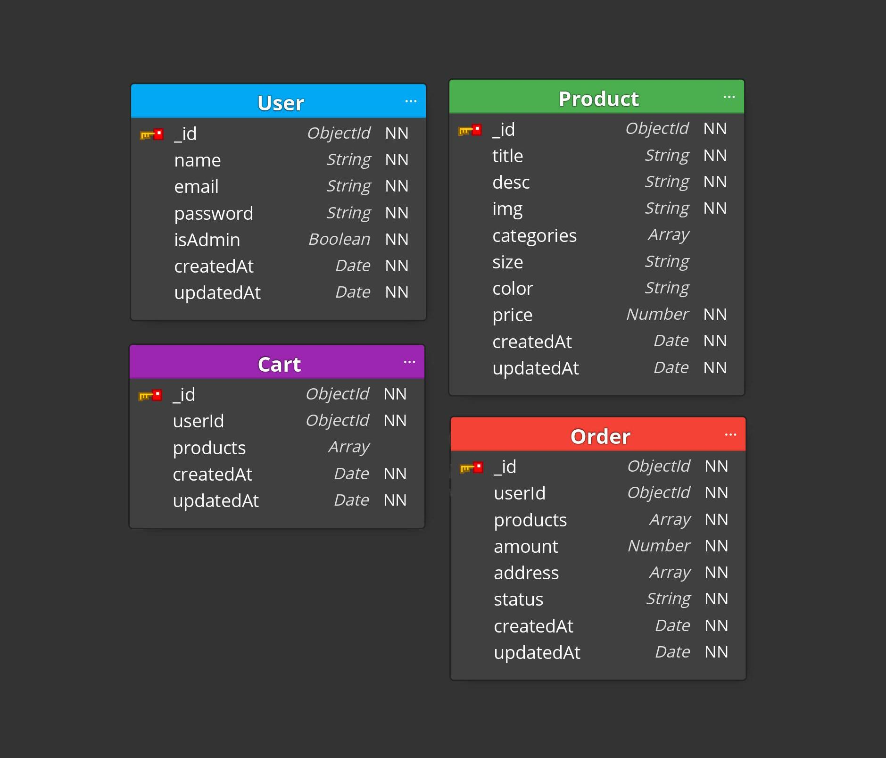

<h1 align="center">
  E-commerce API
</h1>

<p align="center">

  

  <a href="https://www.linkedin.com/in/dev-gabriel-cordeiro/">
    
  </a>
  
  

  <a href="https://github.com/GabrielCordeiroDev/ecommerce-api/commits/main">
    
  </a>

  <a href="https://github.com/GabrielCordeiroDev/ecommerce-api/issues">
    
  </a>
  
  

</p>

<p align="center">
  <a href="#-about-the-project">About the project</a>&nbsp;&nbsp;&nbsp;|&nbsp;&nbsp;&nbsp;
  <a href="#-technologies">Technologies</a>&nbsp;&nbsp;&nbsp;|&nbsp;&nbsp;&nbsp;
  <a href="#-getting-started">Getting started</a>&nbsp;&nbsp;&nbsp;|&nbsp;&nbsp;&nbsp;
  <a href="#-how-to-contribute">How to contribute</a>&nbsp;&nbsp;&nbsp;|&nbsp;&nbsp;&nbsp;
  <a href="#-license">License</a>
</p>

<p id="insomniaButton" align="center">
  <a href="https://insomnia.rest/run/?label=%20Ecommerce%20API&uri=https%3A%2F%2Fraw.githubusercontent.com%2FGabrielCordeiroDev%2Fecommerce-api%2Fmain%2FInsomnia.json" target="_blank"></a>
</p>

## 👨🏻‍💻 About the project

This project is a REST API of a fictitious ecommerce.

<h1 align="center">
  
</h1>


## 🚀 Technologies

Technologies that I used to develop this API:

- [Node.js](https://nodejs.org/en/)
- [TypeScript](https://www.typescriptlang.org/)
- [Express](https://expressjs.com/pt-br/)
- [Mongoose](https://mongoosejs.com/)
- [Stripe](https://github.com/stripe/stripe-node)
- [Jest](https://jestjs.io/)
- [JWT-token](https://jwt.io/)
- [CryptoJS](https://github.com/brix/crypto-js)
- [Tsyringe](https://github.com/Microsoft/tsyringe)
- [Husky](https://github.com/typicode/husky)
- [Commitlint](https://github.com/conventional-changelog/commitlint)
- [Commitizen](https://github.com/commitizen/cz-cli)
- [Lint Staged](https://github.com/okonet/lint-staged)
- [Babel](https://babeljs.io/)
- [Eslint](https://eslint.org/)
- [Prettier](https://prettier.io/)

## 💻 Getting started

Import the `Insomnia.json` on Insomnia App or click on [Run in Insomnia](#insomniaButton) button.

### Requirements

- [Node.js](https://nodejs.org/en/)
- [Yarn](https://classic.yarnpkg.com/) or [npm](https://www.npmjs.com/)
- One instance of [MongoDB](https://www.mongodb.com/)

**Clone the project and access the folder**

```bash
$ git clone https://github.com/GabrielCordeiroDev/ecommerce-api
cd ecommerce-api
```

**Follow the steps below**

```bash
# Install the dependencies
$ yarn

# Make a copy of '.env.example' to '.env'
# and set with YOUR environment variables
$ cp .env.example .env

# To finish, run the API service
$ yarn dev

# Well done, project is started!
```

## 🤔 How to contribute

**Make a fork of this repository**

```bash
# Fork using GitHub official command line
# If you don't have the GitHub CLI, use the web site to do that.

$ gh repo fork GabrielCordeiroDev/ecommerce-api
```

**Follow the steps below**

```bash
# Clone your fork
$ git clone your-fork-url && cd ecommerce-api

# Create a branch with your feature
$ git checkout -b my-feature

# Make the commit with your changes
$ git commit -m 'feat: My new feature'

# Send the code to your remote branch
$ git push origin my-feature
```

After your pull request is merged, you can delete your branch.

## 📝 License

This project is licensed under the MIT License - see the [LICENSE](https://github.com/GabrielCordeiroDev/ecommerce-api/blob/main/LICENSE) file for details.

---

Made with 💜 &nbsp;by Gabriel Cordeiro 👋 &nbsp;[See my Linkedin](https://www.linkedin.com/in/dev-gabriel-cordeiro/)
